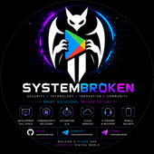
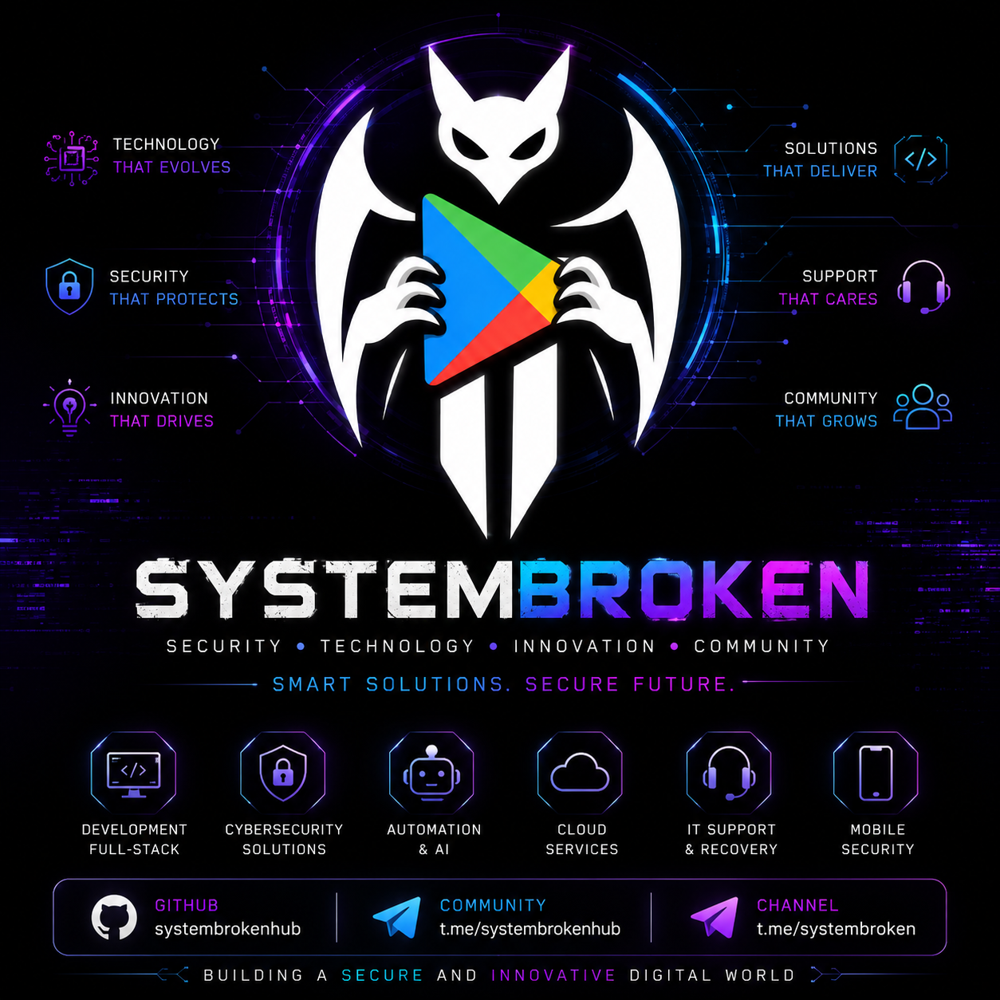

 
  
       👑 SYSTEM BROKEN HUB 🔥

Mobile Security • Cybersecurity • Artificial Intelligence • Innovation

 

🚀 Technology Connects • Security Unites

---

🛡️ About SystemBroken

SystemBrokenHub is a technology community dedicated to cybersecurity, mobile application security, software development, artificial intelligence and digital innovation.

Our mission is to connect developers, researchers, students and technology enthusiasts through collaboration, learning, open-source initiatives and advanced technology solutions.

 

---

⚡ Core Areas

Area| Focus
📱 Mobile Security| Android Security, Mobile Protection & Application Analysis
🔐 Cybersecurity| Security Research, Threat Analysis & Defense
🤖 Artificial Intelligence| AI Solutions, Machine Learning & Automation
💻 Software Development| Full-Stack Engineering & Modern Applications
☁️ Cloud Computing| Infrastructure, Deployment & Cloud Services
🌐 Open Source| Community Projects & Knowledge Sharing
🔍 Reverse Engineering| Application Analysis & Security Research
🛡️ Digital Privacy| Data Protection & Privacy Technologies
⚙️ Automation| Intelligent Workflows & Process Optimization

---

🛠️ Technology Stack

  

---

🧠 Knowledge & Skills

Category| Expertise
📱 Mobile Security| Mobile Application Security
🔐 Cybersecurity| Security Research & Threat Analysis
💻 Development| Full-Stack Development
🤖 Artificial Intelligence| AI & Machine Learning
☁️ Cloud Technologies| Cloud Services & Infrastructure
🔍 Reverse Engineering| Application Analysis
🛡️ Privacy| Digital Privacy & Protection
⚙️ Automation| Automation Systems & Workflows
🖥️ IT Services| Technical Support & IT Consulting
🌐 Open Source| Community Collaboration
🐧 Linux| Linux Administration
🌍 Networking| Network Security
🏗️ Architecture| Software Architecture

---

🚀 Professional Profile

Strength| Description
🧠 Innovation| Continuous exploration of emerging technologies
🔒 Security| Focus on secure-by-design solutions
🚀 Performance| Scalable and efficient systems
🌍 Community| Knowledge sharing and collaboration
📚 Learning| Continuous improvement and research
⚡ Technology| Modern tools, frameworks and platforms

---

📊 GitHub Analytics

---

🔥 Activity Graph

---

🌐 Community

📢 Telegram Channel

  
 https://t.me/systembroken

 💬 Telegram Community

https://t.me/systembrokenhub

 🗣️ LinkedIn

https://www.linkedin.com/in/system-broken-b59436418

 👥 Instagram 

https://instagram.com/systembrokenhub

---

🏆 Goals

✅ Knowledge Sharing

✅ Cybersecurity Awareness

✅ Open Source Contributions

✅ Innovation & Research

✅ Community Growth

✅ Future Technology Development

✅ Technology Education

✅ Global Collaboration

---

  
      👑 SYSTEMBROKEN COMMUNITY

Building The Future Securely

Security • Technology • Innovation • Community

